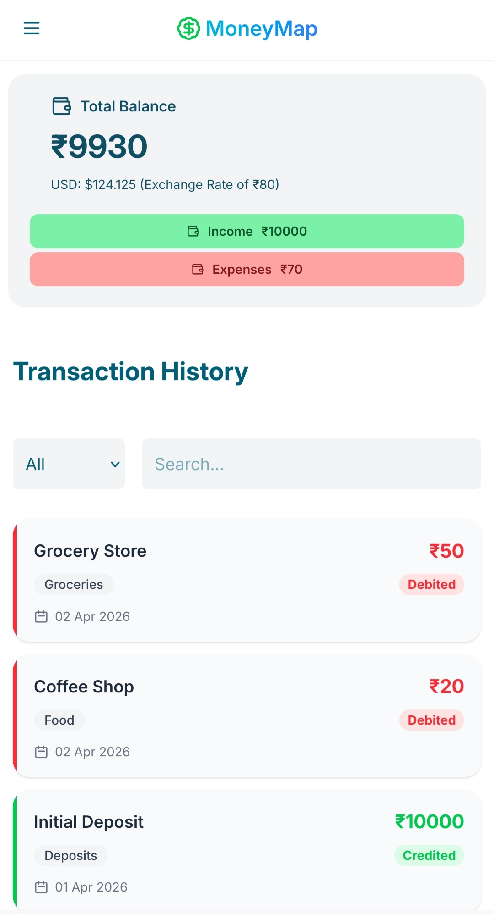
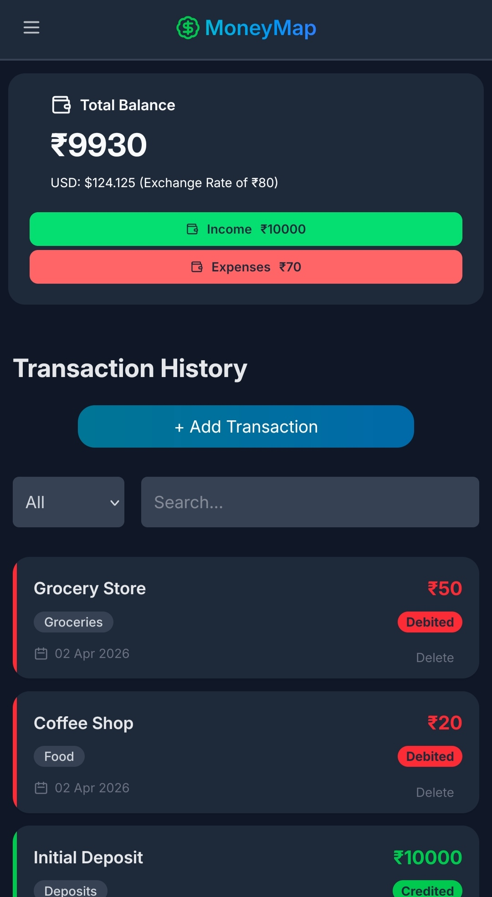
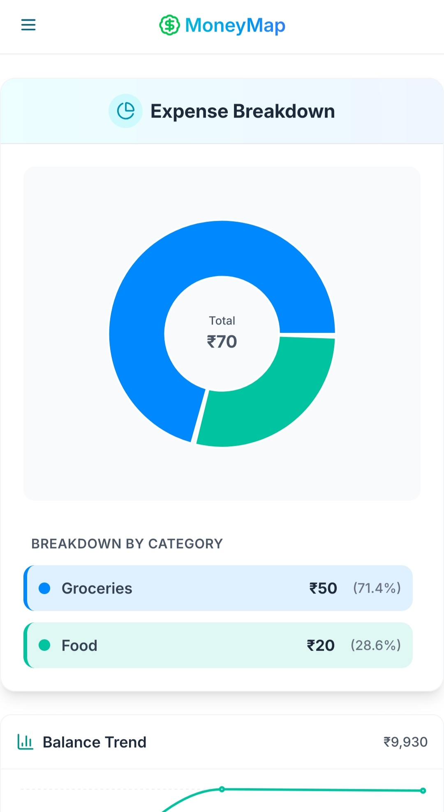
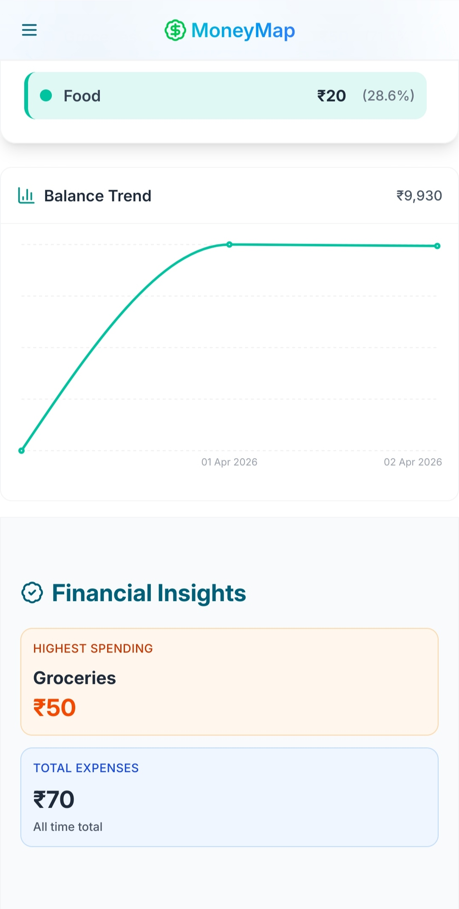
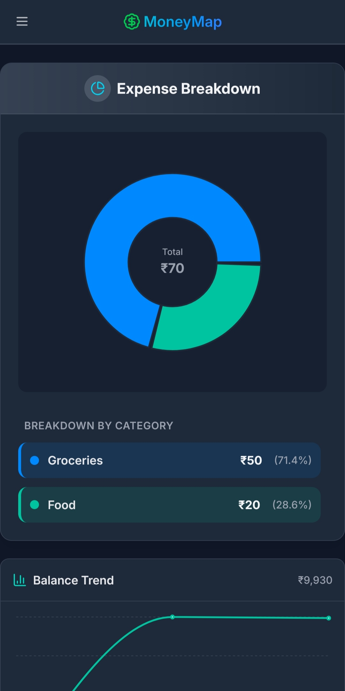
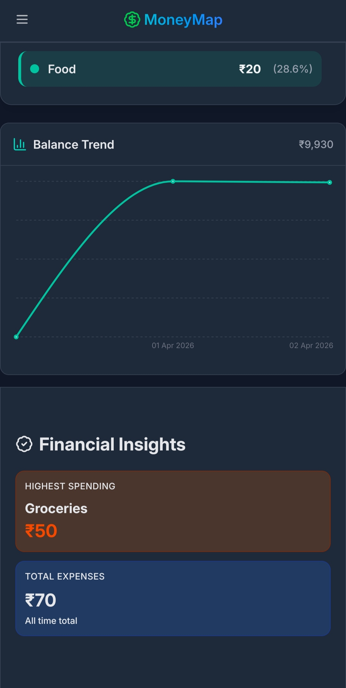

# 💰 MoneyMap — Finance Dashboard

A clean and interactive finance dashboard built to track transactions, visualize spending, and understand financial activity.

---

## 🚀 Overview

MoneyMap is a frontend-only dashboard that allows users to:

* View financial summaries
* Track transactions
* Analyze spending patterns
* Interact with data through filters, charts, and insights

This project focuses on **UI design, state management, and data handling** without any backend dependency.

---

## ✨ Features

### 📊 Dashboard

* Total Balance, Income, and Expenses summary cards
* 📈 Balance trend (Line Chart)
* 🥧 Spending breakdown by category (Pie Chart)

### 💳 Transactions

* View all transactions with details
* Add new transactions (Admin only)
* Delete transactions (Admin only)
* Filter by type (Income / Expense)
* Search transactions by title

### 🔐 Role-Based UI

* **Viewer** → Read-only access
* **Admin** → Can add & delete transactions

### 🧠 Insights

* Highest spending category
* Total expenses overview
* Simple financial observations

### 💾 Persistence

* Data stored using **LocalStorage**
* Retains transactions even after page refresh

---

## 🛠️ Tech Stack

* **React (Vite)**
* **Tailwind CSS**
* **Recharts**
* **Context API (State Management)**

---

## 📂 Project Structure

```
src/
 ├── components/
 │    ├── Navbar.jsx
 │    ├── SummaryCards.jsx
 │    ├── TransactionList.jsx
 │    ├── TransactionForm.jsx
 │    ├── Filters.jsx
 │    ├── CategoryPieChart.jsx
 │    ├── BalanceLineChart.jsx
 │    └── Insights.jsx
 │    └── Sidebar.jsx
 │
 ├── pages/
 │    ├── Dashboard.jsx
 │    └── InsightsPage.jsx
 │
 ├── context/
 │    └── AppContext.jsx
 │
 ├── data/
 │    └── dummyData.js
 │
 └── App.jsx
```

---

## ⚙️ Getting Started

### 1. Clone the repository

```
git clone https://github.com/srthkw/moneymap
```

### 2. Install dependencies

```
npm install
```

### 3. Run the app

```
npm run dev
```

---

## 🧪 Data Handling

* Uses mock transaction data initially
* Automatically switches to LocalStorage once data is modified
* Supports dynamic updates (add/delete/filter/search)

---

## 🎯 Key Concepts Demonstrated

* Component-based architecture
* Global state management with Context API
* Data transformation (filtering, grouping, aggregation)
* Conditional rendering (role-based UI)
* Chart integration with transformed data
* Persistent state using LocalStorage

---

## 📌 Notes

* This project is frontend-only and uses mock data
* Designed to demonstrate problem-solving and UI/UX thinking
* Not intended as a production-ready finance system

---

## 📷 Screenshots

### Dashboard












---

## 👨‍💻 Author

**Sarthak Mohite**

---

## 🚀 Final Thoughts

This project focuses on building a **functional, structured, and user-friendly dashboard** rather than overcomplicating features.

---
